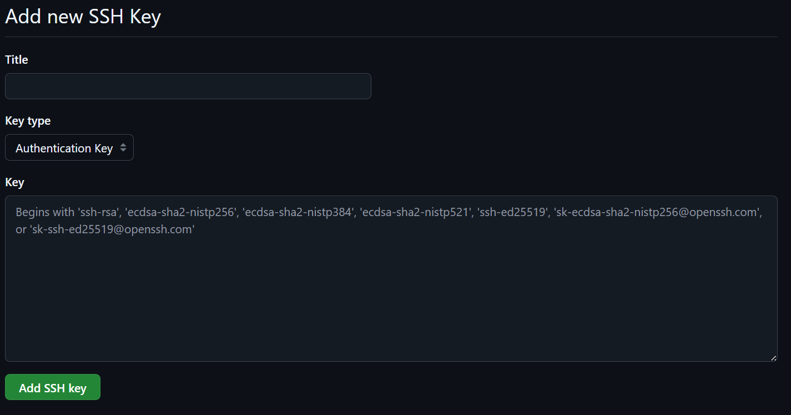

# Git 使用 SSH 连接 GitHub

!!! note

    大部分情况下，我们能直接访问 [GitHub](https://github.com)，但大部分情况出现的概率很低。此时即便设法让浏览器能够正确访问 GitHub，git 却没办法连接 GitHub。使用 SSH 连接 GitHub 可以解决此类问题。
    
    本文参考了 https://zhuanlan.zhihu.com/p/688103044 以及 https://blog.csdn.net/problc/article/details/144365441 的内容。


## 0x00 配置 SSH key

打开 Git Bash。


先输入下面的指令查看有没有已经创建的 SSH key

```bash
cd ~/.ssh
```

=== "如果报错 `no such file or directory`"

    这是因为这台电脑上没有生成过 SSH key，使用下面指令生成 SSH key：
    
    ```bash
    ssh-keygen -t rsa -C "xxx@xxx.com"  // 将 "xxx@xxx.com" 替换为你自己GitHub的邮箱地址
    ```
    
    随后一直按 ++enter++ 直到密钥的 randomart image 出来为止。
    
    ???+ note
    
        这里是把 ssh passphrase 留空了。根据实际需要考虑要不要设置。


=== "如果没有报错并进入了 `/ssh` 目录"

    这台电脑上已生成过 SSH key，进入下一步。


## 0x01 获得并复制 SSH 公钥内容

还是在 Git Bash 终端，输入下列指令：

```bash
cd ~/.ssh
cat id_rsa.pub
```

此时会看到 SSH 公钥内容，格式如下：

```
ssh-rsa AA1AB2BB3CC4CD5DD……XX6XY7YY8ZZ9Z darrindeyoung@example.com
```

用鼠标选择自 `ssh-rsa` 起至邮箱地址止（也就是全部内容）后右键（copy）复制。

## 0x02 在 Github 设置中输入公钥

访问 [Github 的 SSH and GPG keys](https://github.com/settings/keys) 设置页面，点击“New SSH”按钮。


在 Title 处随便取个名字，然后在 Key 处粘贴之前复制的公钥，最后点 Add SSH key。




## 0x03 修改 SSH 端口

即便完成上述设置后，在使用 git 时可能遇到此类报错：

```bash
ssh: connect to host github.com port 22: Connection timed out 
fatal: Could not read from remote repository.

Please make sure you have the correct access rights and the repository exists.
```

这是因为 SSH 的 22 端口连不上，需要改成 443 端口。

=== "Windows"

    在 Windows 下，SSH 配置文件（config）通常位于用户目录的 `.ssh` 文件夹中（例如：`C:\Users\darri\.ssh\config`）。
    
    ???+ note
    
        如果没有就创建一个。
    
    使用记事本或者 VS Code 打开，添加以下内容：

    ```config
    Host github.com
        Hostname ssh.github.com
        User git
        Port 443
        PreferredAuthentications publickey
        IdentityFile ~/.ssh/id_rsa
    ```

=== "Linux和MacOS"

    SSH 的配置文件通常位于 `~/.ssh/config`，如果文件不存在，可以手动创建一个：

    ```bash
    touch ~/.ssh/config
    ```

    打开文件添加以下内容：

    ```config
    Host github.com
        HostName ssh.github.com
        User git
        Port 443
        PreferredAuthentications publickey
        IdentityFile ~/.ssh/id_rsa
    ```

现在来检测连接是否正常。在终端输入下面的指令：

```bash
ssh -T git@github.com
```

如果正确配置，终端将返回类似以下内容：

```bash
Hi darrindeyoung791! You've successfully authenticated, but GitHub does not provide shell access.
```

在终端执行下面的指令，确保 git 使用新端口：

```bash
git config --global url."ssh://git@ssh.github.com:443".insteadOf "ssh://git@github.com"
```

---
本文完。